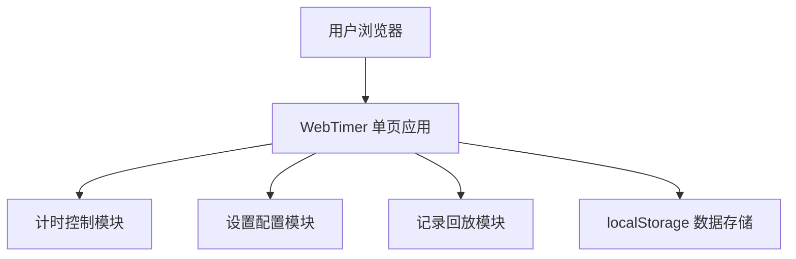

# WebTimer 技术架构文档

## 1. 系统总体架构

### 1.1 系统架构描述

由于用户需求明确要求**离线运行、无服务端、无依赖，因此采用**纯前端单页应用（SPA）\*\*架构。



### 1.2 核心模块划分

| 模块名称   | 功能描述                      |
| ------ | ------------------------- |
| 计时控制模块 | 开始、暂停、继续、结束、重置计时器         |
| 设置配置模块 | 赛事名称、背景、提示音、计时时间设置        |
| 记录回放模块 | 比赛记录存储、历史列表、回放功能          |
| 数据存储模块 | localStorage封装，持久化存储配置和记录 |
| UI展示模块 | 美观界面、响应式布局、动画效果           |

### 1.3 数据流向

```
用户操作 → 事件处理 → 状态更新 → UI刷新 → localStorage存储
记录读取 ← 回放控制 ← 历史数据
```

## 2. 技术栈选型

### 2.1 技术栈选择

| 层级   | 技术选型                                | 选型理由               |
| ---- | ----------------------------------- | ------------------ |
| 核心   | 原生 HTML5 + CSS3 + JavaScript (ES6+) | 满足无依赖、离线运行、开箱即用的需求 |
| 样式   | Tailwind CSS (CDN)                  | 提供现代化样式，快速开发美观界面   |
| 数据存储 | localStorage                        | 浏览器原生支持，无需数据库      |
| 音频   | HTML5 Audio API                     | 原生支持提示音播放          |

### 2.2 为什么不使用框架？

- **Vue/React 框架**：需要构建工具和依赖管理，不满足"无依赖"需求
- **构建工具**：Webpack/Vite 等会增加复杂度
- **单文件即可运行**：直接打开 HTML 文件即可使用

## 3. 核心数据模型设计

### 3.1 数据实体定义

#### 3.1.1 比赛配置 (GameConfig)

```javascript
{
  id: "config",
  eventName: "比赛名称",
  backgroundImage: "", // 背景图片base64
  soundAlert: "", // 结束提示音base64
  countdownTime: 300, // 倒计时秒数，默认5分钟
  themeColor: "#3b82f6", // 主题色
  intervalAlert: {
    enabled: false, // 间隔提示音开关
    interval: 60, // 间隔秒数
    unit: "seconds" // "seconds" | "minutes"
  },
  createdAt: "2024-01-01T00:00:00.000Z",
  updatedAt: "2024-01-01T00:00:00.000Z"
}
```

#### 3.1.2 比赛记录 (GameRecord)

```javascript
{
  id: "record_${timestamp}",
  eventName: "比赛名称",
  startTime: "2024-01-01T00:00:00.000Z",
  endTime: "2024-01-01T00:05:00.000Z",
  duration: 300, // 实际耗时秒数
  status: "completed", // completed/paused
  timestamps: [
    { type: "start", time: "..." },
    { type: "pause", time: "..." },
    { type: "resume", time: "..." },
    { type: "end", time: "..." }
  ],
  createdAt: "2024-01-01T00:00:00.000Z"
}
```

### 3.2 localStorage 存储结构

```javascript
// localStorage 存储键值
{
  "webtimer_config": GameConfig,
  "webtimer_records": GameRecord[]
}
```

## 4. 功能规格说明

### 4.1 计时功能

- 倒计时显示（时:分:秒.毫秒）
- 开始/暂停/继续/结束/重置
- 倒计时结束时播放提示音
- **间隔提示音**：可设置每隔N秒/分钟播放一次提示音
- **计时动画**：数字翻转动画、进度环动画、脉冲发光效果

### 4.2 设置功能

- 赛事名称输入
- 背景图片上传（支持本地图片选择并转为base64存储）
- 提示音上传（支持本地音频选择并转为base64存储）
- 计时时间设置
- 主题色选择
- 间隔提示音开关及间隔时间设置（支持秒/分钟）

### 4.3 记录功能

- 自动保存比赛记录
- 历史记录列表展示
- 记录详情查看
- 记录回放功能
- 记录删除功能

## 5. 开发环境信息

### 5.1 环境配置

- 开发环境：直接在浏览器中打开 index.html
- 不需要任何依赖安装
- 支持 Chrome/Edge/Firefox/Safari 最新版本

### 5.2 文件结构

```
WebTimer/
├── docs/
│   ├── prd/
│   └── tech/
└── web/
    └── index.html  # 单文件应用
```

